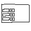

# 游戏设计


## 界面

游戏开始会是一个简单的开始界面，包括有：开始游戏、游戏信息、设置、关于


## 开始游戏

进入游戏后，会开始生成地图房间，在最开始的房间，进入房间之后才开始生成小怪

> 生成的所有房间会预先生成出基础的角色数据。比如小怪，商店，事件消息，地图环境的瓦片，基础的必定掉落的物品

游戏是有一定的时间的，如果超过这个时间，则会出现很强力的怪物，越来越厉害


### 显示效果

角色都有一个颜色轮廓，中立玩家会是白色轮廓，背景装饰都是偏向很暗的颜色，中间层的具有迷惑性的装饰会是稍微偏暗的颜色，正式表现出实际性态时会变成正常颜色


### 属性

世界中会有：【罪恶值】、【时间】、【重大事件表】、【天气】

> - 重大事件表是开始游戏时就生成好的，会达到这个时间之后会产生这个事件
>
> - 天气不是现实世界想的那样的普通天气，可能会有：魔力之时、友善之时、疯狂之时，不同的特殊天气会有小怪和其他属性的影响


## 游戏场景

- 里面的某些草，或者一些装饰是可交互的，比如草移动过去可以被晃动，可能会出现蛇之类的小怪，也可能会掉落浆果、雨露等立即触发使用的增益类物品或状态

- 会有瓦罐之类的，打破可能会出现各种物品，也可能出现蛇、鼠之类的小怪

- 草可以被破坏掉，会有概率出现物品

- 商人也可以攻击，进入范围时，左中偏上（越过左中选项的上边一点）会有是否攻击的按钮，需要按两次进行确定  是否可以攻击，如果可以，则会添加进可受到伤害的判断数据中

- 陷阱的桶：会有一些有概率是小怪的环境对象，如果主动进行攻击破坏，则会出现并开始攻击玩家

- 传奇武器：

- 出入口：会随时有概率出现角色进入，好坏不定


### 角色数据

```
生命：10
希望：10
移动速度：30
等级：1
角色标签：[中立的，骷髅，具有神性的，混乱的，疯狂的，]
世界中所属角色组：[玩家，野兽，鬼怪，植物，]
拥有物品：[]
状态：[]
技能：[]
```

> 【混乱的】角色会**攻击任何角色，没有对其友好的单位**
>
> 【疯狂的】不会受到【恐惧】的影响，会一直追击攻击目标
>
> 【具有神性的】会有特殊属性加成（暂定）


### 角色生成

> 角色会有掉落物

**蜂巢**：初始会有两只【蜜蜂】，会出来采蜜，默认不攻击玩家，如果受到攻击，会有红色轮廓线。会掉落【蜂刺】，

**头骨**：会隔一段时间出现一次骷髅，骷髅会有生命时限，到时间即会化为头骨，每次结束，骷髅属性就会增长一级，会有初始物品【残破的短剑】，会有【魔化】属性随时间会增长

**藤蔓、草、树**：会有概率出现【蛇】【蜘蛛】

**顶部草（相对“地面的草”来讲是“顶部的”）**：会有概率掉落【蛇】【蜘蛛】

**小屋**：可能是友好角色的屋子，也可能是不友好角色的屋子

**传送门**：可能出现各种小怪，每隔随机时间出现一个，一般是【蝙蝠】、【enemy_beast（野兽，资源文件名）】、【sword (资源文件名)】

**下水口**：有概率出现【老鼠】、【史莱姆】、【魔力章鱼】


### 交互

在左侧居中会出现可操作对象列表，左边是简要目标描述，其右侧会有对应的按钮，点击按钮即可操作对象，如果长按会出现提示信息，出现提示信息时整个游戏会暂停，游戏场景中间出现提示信息，且游戏屏幕呈现毛玻璃背景效果。简要显示如下图：



显示的时候是以这种，从那个节点向下偏移一点位置的地方向上弹出节点


### 一些游戏想法

生命值过低，如果有某些微小生物有仇，会派人过来追杀

如果直接开始复仇，会说：

- 要的就是一个快意恩仇。
- 你快完了，我就来了，这就叫聪明。
- 那个渣渣在哪？
- 以前不敢，现在不得好好教训一顿！


侠士。如果遇见你，而且你身上有【作恶多端】的状态时，话：


阴阳裁官：
黑官：视你作恶次数而定，生成属性和攻击，每过一个阈值，都会增强或增加一个技能
白官：


一些蜜蜂在地图中间盘绕


撒旦/小恶魔：会有时移动一下，进行贩卖物品，如果进入之后不够卖，离开了，他可能有概率（每次移动到一个地点定下之后，才会进行随机生成是否会提示的数据）会再次提示一次：“你买不买，我就要强买强卖！快买！”，并且底部开始有倒计时时间，如果在这个时间内不购买，他将会开始攻击你。并说 “焯！我生气了！”


可以有事件：用生命或其他东西交换物品，或其他东西

世界的罪恶值属性：很多出现的怪物，以及一些事件的怪物的属性会根据罪恶值，而生成额外的属性。一些事件生成的角色会因为这个而会生成好的或者坏的怪物

油桶：爆炸

- 添加牦牛冲撞随机事件

- 加入事件，遇到老奶奶帮还是不帮，有机会获得奖励，不帮有几率老奶奶变成敌人

- 加入树木，有时会从树木中跑出敌人

- 齿轮陷阱

- 动态地形：地面会伸出多个动态移动的地形，从无到有


扩大地图，增加远程攻击怪物，远程毒蛇

增加耐力值，超过耐力，攻击会出现间隔时间，正常只间隔 0.05 秒，攻击反弹子弹

每次新游戏在游戏中都会有概率获得碎片或者叫能量，到达几次或者某个定值即可获得新的开局武器或属性，或人物，或技能

陷阱触发，陷阱物品，捡起会有负面效果，合成物品

残影攻击，会间隔的向前创建一个残影攻击敌人，会触发其他攻击时的效果

少量的地形动态植物等装饰品

技能：火焰雨，区域下起火焰陨石雨

地面会有些萝卜等植物，可收集的物品，也有可能是小怪，捡起后会出现攻击玩家

机关

通过背景面板色区分物品品质

物品碎片，多个物品合成物品

技能树

遇见购物商人，在顶部上方显示水平列表，最多三个物品
点击打开物品栏，之类ui的带点微微果冻的缩放效果

掉落物体，可操作物体，要么用高亮描边，要么设置果冻缩放动画效果

闪电链

电影镜头，上下拉出黑片

以金钱为主，小怪攻击优先掉钱，不够则开始扣除血量，攻击到则开始掉钱，BOSS有的攻击先掉钱，有的直接扣血。


双响炮：发射出去在一段时间后发射两个


阴风鬼火

小怪没钱了会逃跑

如果击杀过多逃跑的小怪，会有插翅难逃的提示
每次房间生成小怪，有概率是中立的

第一次出厂的BOSS都会有一个电影镜头逐步缩放放大移动到他的位置

小蜜蜂陷阱，被打破之后会出现一群蜜蜂攻击

默认攻击伤害范围为射线，然后才是区域伤害

环境系统，不同时间世界会改变颜色

大杯咒：我要这个大杯咒 对不起先生这是特大杯 中杯咒 大杯 特大杯 我就要这个三个里的大杯咒 对不起先生 这是特大杯 罗老师别这样

空中漂浮着幽魂

小怪死亡消散，向上升起一点距离变成幽魂，有机会再次产生其他小怪

名称：神秘的义父

死亡爆炸

当年国内能去东南亚和三不管地带找钱的都是狠人，不是跨国黑帮就是悍匪暴徒。现在的阿狗阿猫们没这能耐也想玩就是找虱了。


游戏底部添加突然出现一条野猪

场景环境中镶嵌怪物，有时会镶嵌的怪物会变成活物从场景环境中出现，可以是石化的，或者融为场景一体的


请选择你的人生导师：撒旦、小丑


多重施法：有概率施放多次法术

青花瓷狼牙棒：只能攻击使用一次，发出之后被攻击到的敌人的位置会爆出一堆尖刺，可拾取用于攻击远处敌人


## 话

会话：要的就是一个偷袭，复仇

老奶奶话：你要敢吓到我孙子我打死
话：你妈会迁就你，但阎王不会

话：我不看重钱，我只击破你的邪恶

话：出家人当以降妖除魔为己任，这红粉骷髅，老衲就收下了\[合十\]\[旺柴\]

话：红粉骷髅而已[Worship]吾自依然向道！

我打不过我还不会跑吗，我非得在这儿啊，真搞笑

我说我杀人不眨眼，你问我眼睛干不干？

善良的商人：我名字叫“善良的商人”我就得善良了吗，叫“有德”“富贵”的名字的人就必须得有德、富贵吗！一眼定真，你在纯纯的搞笑
